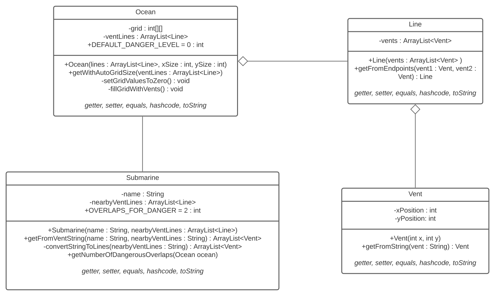

# Case Study

## Situation

We are a submarine and we want to cross a field of hydrothermal vents on the ocean floor. 
The clouds generated by the hydrothermal vents should ideally be avoided.
  

### Information given:
- Ocean acts as a grid 
  - Origin in the left top corner
- Vents form in lines
  - List of Strings with following presentation: X,Y -> X,Y
  - Given as input
- Vent lines can cross each other
- When lines cross it's more dangerously
  

### Goal:
Number of points where at least two vent lines overlap
  

### To Do:

- [x] Class diagramm 
- [x] Java Implementation

---

## Realization

### 1. Converted the given information 
- Ocean is a Grid => 2D Array
  - Int arrays: Easier to detect and implement overlapping lines
- Nearby vents from submarin => Submarine class
  - Responsible for conversion of the String input to lines and vents
- Presentation: X,Y -> X,Y
  - X,Y => Vent class consisting of position
  - Line of vents => Line class consisting of vents

  

### 2. Create the UML Class Diagram

- Use of static factory methods 
- Test classes, getters, setters, equals, hashCode and toString not included for simplicity

Submarine | Ocean | Line | Vent
---|---|---|---
Manages the input string | Represents the map with the vents | Represents a line of vents | Represents a vent

  

### 3. Implementation in Java

- TDD with UnitTests via JUnit
  - Order:
    1. Vent
    2. Line
    3. Ocean
    4. Submarine
